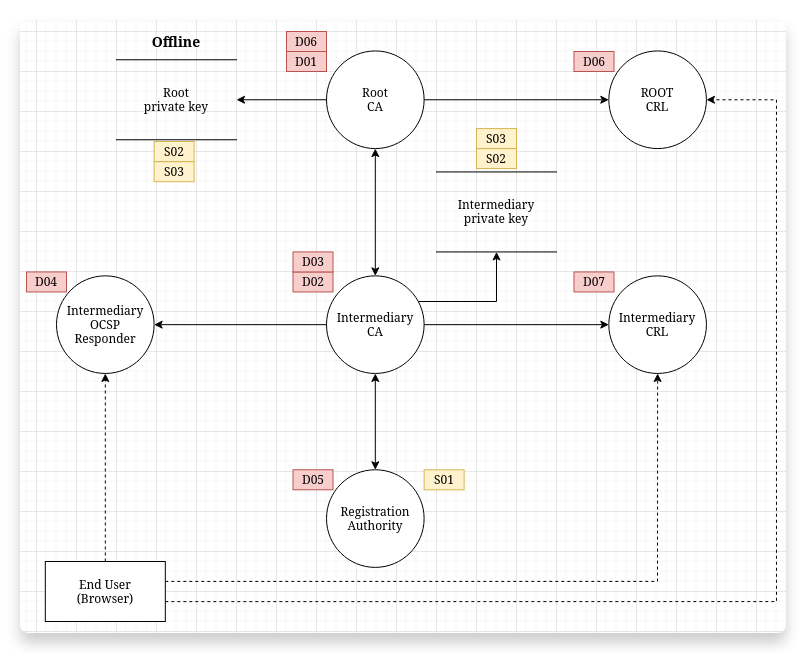
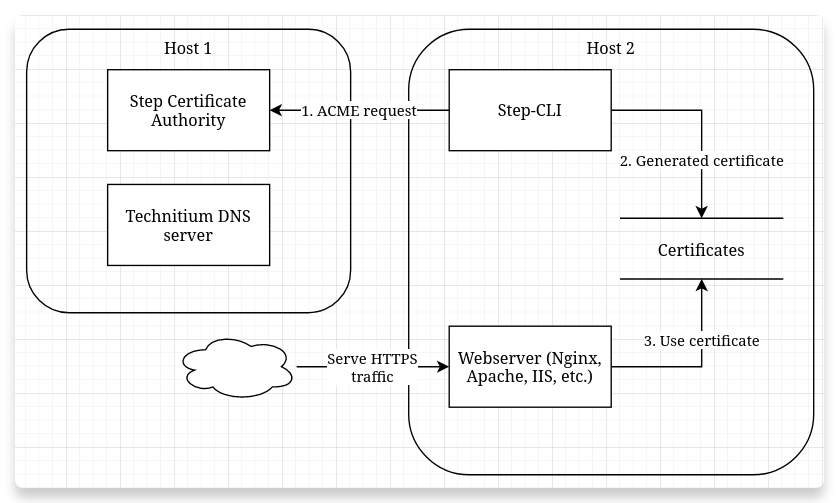
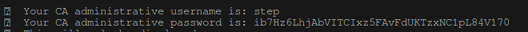
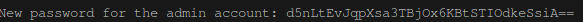

# Project 2: Private Key Infrastructure

Link to Git repo: https://github.com/kelvin-ap/CSA-PKI/

## Team Members

- Jasper Van Meel
- Dante Requena
- Kelvin Bogaerts
- Niels Van De Ginste
- Tom Goedemé

## 1. Threat model

We have created the following threat model for a typical PKI setup with a root CA and an intermediate CA.



Below you can see both a DREAD and a STRIDE analysis of the threat model. It is noteworthy that D03, 'Weak key generation algorithms,' stands out with the highest average risk score of 8.2. Despite the high score, this problem can be easily mitigated by using safe key generation algorithms.

### 1.1. DREAD

| ID  | Description                                     | Damage | Reproducibility | Exploitability | Affected users | Discoverability | Average |
| --- | ----------------------------------------------- | ------ | --------------- | -------------- | -------------- | --------------- | ------- |
| D01 | Root CA private key getting compromised         | 10     | 1               | 1              | 10             | 1               | 4.6     |
| D02 | Intermediary CA private key getting compromised | 8      | 2               | 3              | 8              | 1               | 4.4     |
| D03 | Weak key generation algorithms                  | 10     | 3               | 8              | 10             | 10              | 8.2     |
| D04 | OCSP responder outage                           | 7      | 3               | 4              | 8              | 5               | 5.4     |
| D05 | Registration authority getting compromised      | 8      | 3               | 3              | 8              | 3               | 5       |
| D06 | Root CRL outage                                 | 9      | 3               | 4              | 10             | 3               | 5.8     |
| D07 | Intermediary CRL outage                         | 8      | 3               | 3              | 8              | 4               | 5.2     |
| D08 | Registration authority outage                   | 5      | 7               | 4              | 3              | 4               | 4.6     |
| D09 | Certificate expiry                              | 10     | 1               | 1              | 10             | 1               | 4.6     |

### 1.2. STRIDE

| ID  | Description                   | Threat Type                          |
| --- | ----------------------------- | ------------------------------------ |
| S01 | Fake ownership of domain name | Spoofing                             |
| S02 | Key recovery attack           | Information disclosure               |
| S03 | Key escrow attack             | Repudiation / Information disclosure |
| S04 | Certificate revocation bypass | Tampering                            |

## 2. Overview

### 2.1. Design

In our design, we used 2 hosts for running all the Docker containers. One host runs Step CA server & Technitium DNS, the other runs a webserver and Step CLI. We opted for 2 different hosts, since we ran into trouble with the validation process for requesting certificates when they ran on the same host. We believe this to be related to the containers using Docker's internal IP addresses for internal communication instead of the IP address of the Docker host.



### 2.2. Glossary

| Term | Meaning                            |
| ---- | ---------------------------------- |
| CA   | Certificate Authority              |
| PKI  | Public Key Infrastructure          |
| OCSP | Online Certificate Status Protocol |
| CRL  | Certificate Revocation List        |

## 3. Step CA & Technitium DNS

The Docker compose file in the `step-ca` directory consist of two components: the Certificate Authority (`smallstep/step-ca:0.25.0`) and the DNS Server (`technitium/dns-server:11.4.1`). Both containers use a Docker volume to store their data.

Note: we're assuming that there are 2 machines for this project: one running the DNS & CA server, and one running the webserver.

### 3.1. Environment variables

All the environment variables that need to be changed are present in the `env.sample` file. Before running, copy `env.sample` to `.env` and fill in the desired values for the variables.

Below a brief description of both the environment variables
- `PKI_DOMAIN_NAME`: this is the domain name for your PKI. Both the DNS and the CA will use this environment variable to create their "environment". The names of the containers also use this variable. This is necessary to create a consistent automation flow.
- `EXTRA_ALLOWED_INCOMING_NAMES`: this is a list of all the different domain names your where the CA will accept requests from. The `ca.$PKI_DOMAIN_NAME` is standard included in the file.

>Do not change any environment variable in de Docker compose file. If you do, the automation scripts might not work correctly.

### 3.2. Running the compose file

To start our PKI environment, we first need to launch the Docker compose file: `docker compose up`. Execute this command in the folder where the `docker-compose.yml` is located.

>**You** are responsible for keeping all the secrets safely. At the first boot of your environment, the ca will print the password to the log output. You can view it using `docker compose logs`.



When the environment is up and running, it is time to configure the DNS server. Just run the `configure_dns` script with this command: `./initial_configure_dns.sh`. Again, run this command in the folder where the script is located.

The following actions will happen:

1. The variables from the `.env` are loaded in.
2. The script will wait for the DNS container if it's not already up
3. When the container is up, the `setup_dns.sh` script inside the container gets executed to set up all the init actions. The following things wil happen:
	1. The necessary packages get installed
	2. Small-step CA client gets installed in the container environment
	3. A certificate will be requested at the CA (since both containers run in the same docker environment, name resolution is not a problem.)
	4. The certificate gets converted to a `.pfx` file. The DNS server only accepts this format.
	5. A random password gets generated and the default "admin" password will be overwritten.
	6. A big requests is made to the DNS server to set up an the initial configuration.
	7. Finally the password for the DNS server will be shown to the user.
4. After the setup of the DNS server, the `resolve.conf` file of the CA gets changed, so it used the freshly configured DNS server as its resolver for ACME challenges.
5. _The end_

>Again, keep the password of the dns server somewhere safe. This script doesn't work when the default admin pass is not present. You cannot run this a second time to "reset" your password!



### 3.3. Configure the DNS server

The DNS server should be running at 
You have to add the default zone (`$PKI_DOMAIN_NAME`) manually, after that you can add the desired records in the settings.

## 4. Prepare clients

Before you can requests certificates, you first need to make the CA's domain name known to your host. This can be done by using the DNS server (if this server contains a record of the CA.) Otherwise you can add the IP of the CA manually in your `/etc/hosts`.

## 5. Installing the root certificate

To install the certificate of the Certificate Authority, you can run `./install_certs.sh`. This script will do the following:

1. The .env file gets loaded into the script.
2. The root certificate will be downloaded.
3. The certificate gets installed into your default trust store.

>You can uninstall the cert with the following commando: `step certificate uninstall ./root_ca.crt`

## 6. Requesting certificates for the webservers

Assuming you have set up the CA and DNS servers correctly, you can requests certificates via Step-cli for a webserver. Below we describe the process for Apache, Nginx and IIS.

### 6.1. Apache

Before bringing the Docker compose file up, make sure to put the IP of the DNS server in the `/etc/resolv.conf` file of the host where the containers will run, e.g. if the IP is `192.168.0.16`:

```ini
# /etc/resolv.conf
nameserver 192.168.0.16
```

Copy `env.sample` to `.env` and change the variables according to your needs. `PKI_DOMAIN_NAME` is the same as before, `DOMAIN` is the domain which Apache should serve. After that, run `docker compose up -d` to start the Apache and Step-cli containers.


### 6.2. Nginx & Wordpress

Before bringing the Docker compose file up, make sure to put the IP of the DNS server in the `/etc/resolv.conf` file of the host where the containers will run, e.g. if the IP is `192.168.0.16`:

```ini
# /etc/resolv.conf
nameserver 192.168.0.16
```

Copy `env.sample` to `.env` and change the variables according to your needs. `PKI_DOMAIN_NAME` is the same as before, `DOMAIN` is the domain which Apache should serve. The other variables are the credentials of the MySQL container. After that, run `docker compose up -d` to start the Nginx, Step-cli, Wordpress & MySQL containers.

### 6.3. IIS

IIS is a little trickier, please see the [instructions in the `IIS` folder](./IIS/README.md) for an installation guide. Note that we did not get IIS to work with our SSL certificates in Docker containers, only with the manual installation.
