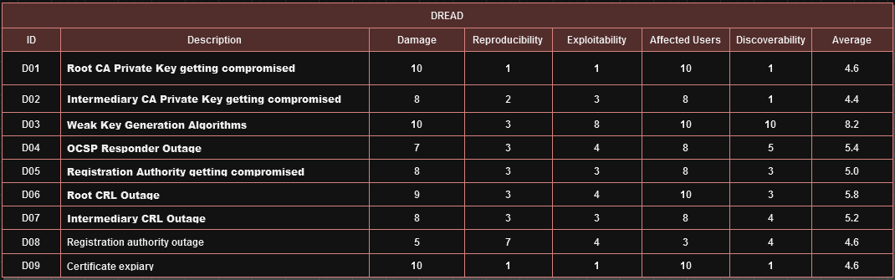
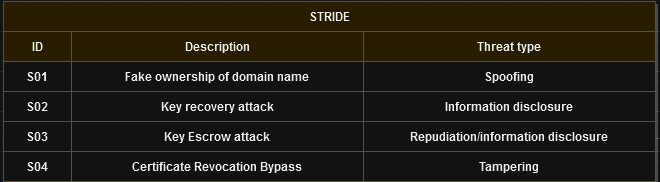

# Project 2: Private Key Infrastructure

Link to Git repo: https://github.com/kelvin-ap/CSA-PKI/

## Team Members

- Jasper Van Meel
- Dante Requena
- Kelvin Bogaerts
- Niels Van De Ginste
- Tom Goedemé

<div style="page-break-after: always; visibility: hidden">
\pagebreak
</div>

## 1. Threat model

We have created the following threat model for a typical PKI setup with a root CA and an intermediate CA.


<div style="page-break-after: always; visibility: hidden">
\pagebreak
</div>

Below you can see both a DREAD and a STRIDE analysis of the threat model. It is noteworthy that D03, 'Weak key generation algorithms,' stands out with the highest average risk score of 8.2. Despite the high score, this problem can be easily mitigated by using safe key generation algorithms.

### 1.1. DREAD


### 1.2. STRIDE



<div style="page-break-after: always; visibility: hidden">
\pagebreak
</div>

## 2. Overview

### 2.1. Design

In our design, we used 2 hosts for running all the Docker containers. One host runs Step CA server & Technitium DNS, the other runs a webserver and Step CLI. We opted for 2 different hosts, since we ran into trouble with the validation process for requesting certificates when they ran on the same host. We believe this to be related to the containers using Docker's internal IP addresses for internal communication instead of the IP address of the Docker host.


### 2.2. Glossary

| Term | Meaning                            |
| ---- | ---------------------------------- |
| CA   | Certificate Authority              |
| PKI  | Public Key Infrastructure          |
| OCSP | Online Certificate Status Protocol |
| CRL  | Certificate Revocation List        |

<div style="page-break-after: always; visibility: hidden">
\pagebreak
</div>

## 3. Step CA & Technitium DNS

The Docker compose file in the `step-ca` directory consist of two components: the Certificate Authority (`smallstep/step-ca:0.25.0`) and the DNS Server (`technitium/dns-server:11.4.1`). Both containers use a Docker volume to store their data.

Note: we're assuming that there are 2 machines for this project: one running the DNS & CA server, and one running the webserver.

### 3.1. Environment variables

All the environment variables that need to be changed are present in the `env.sample` file. Before running, copy `env.sample` to `.env` and fill in the desired values for the variables.

Below a brief description of both the environment variables
- `PKI_DOMAIN_NAME`: this is the domain name for your PKI. Both the DNS and the CA will use this environment variable to create their "environment". The names of the containers also use this variable. This is necessary to create a consistent automation flow.
- `EXTRA_ALLOWED_INCOMING_NAMES`: this is a list of all the different domain names your where the CA will accept requests from. The `ca.$PKI_DOMAIN_NAME` is standard included in the file.

>Do not change any environment variable in de Docker compose file. If you do, the automation scripts might not work correctly.

<div style="page-break-after: always; visibility: hidden">
\pagebreak
</div>

### 3.2. Running the compose file

To start our PKI environment, we first need to launch the Docker compose file: `docker compose up`. Execute this command in the folder where the `docker-compose.yml` is located.

>**You** are responsible for keeping all the secrets safely. At the first boot of your environment, the ca will print the password to the log output. You can view it using `docker compose logs`.


When the environment is up and running, it is time to configure the DNS server. Just run the `start_pki` script with this command: `./start_pki.sh`. Again, run this command in the folder where the script is located.

The following actions will happen:

1. The variables from the `.env` are loaded in.
2. The script will wait for the DNS container if it's not already up
3. When the container is up, the `setup_dns.sh` script inside the container gets executed to set up all the init actions. The following things wil happen:
	1. The necessary packages get installed
	2. Small-step CA client gets installed in the container environment
	3. A certificate will be requested at the CA (since both containers run in the same docker environment, name resolution is not a problem.)
	4. The certificate gets converted to a `.pfx` file. The DNS server only accepts this format.
	5. A random password gets generated and the default "admin" password will be overwritten.
	6. A big requests is made to the DNS server to set up an the initial configuration.
	7. Finally the password for the DNS server will be shown to the user.
4. After the setup of the DNS server, the `resolve.conf` file of the CA gets changed, so it used the freshly configured DNS server as its resolver for ACME challenges.
5. _The end_

>Again, keep the password of the dns server somewhere safe. This script doesn't work when the default admin pass is not present. You cannot run this a second time to "reset" your password!


<div style="page-break-after: always; visibility: hidden">
\pagebreak
</div>

### 3.3. Configure the DNS server

You have to add the default zone (`$PKI_DOMAIN_NAME`) manually, after that you can add the desired records in the settings.

## 4. Prepare clients

Before you can requests certificates, you first need to make the CA's domain name known to your host. This can be done by using the DNS server (if this server contains a record of the CA.) Otherwise you can add the IP of the CA manually in your `/etc/hosts`.

## 5. Installing the root certificate

To install the certificate of the Certificate Authority, you can run `./install_certs.sh`. This script will do the following:

1. The .env file gets loaded into the script.
2. The root certificate will be downloaded.
3. The certificate gets installed into your default trust store.

>You can uninstall the cert with the following commando: `step certificate uninstall ./root_ca.crt`

This command is recommended to run on the hosts that need to trust the certificate of your CA.

## 6. Requesting certificates for the webservers

Assuming you have set up the CA and DNS servers correctly, you can requests certificates automatically via Step-cli for a webserver. Below we describe the process for Apache, Nginx and IIS.

### 6.1. Apache

Before bringing the Docker compose file up, make sure to put the IP of the DNS server in the `/etc/resolv.conf` file of the host where the containers will run, e.g. if the IP is `192.168.0.16`:

```ini
# /etc/resolv.conf
nameserver 192.168.0.16
```

Copy `env.sample` to `.env` and change the variables according to your needs. `PKI_DOMAIN_NAME` is the same as before, `DOMAIN` is the domain which Apache should serve. After that, run `docker compose up -d` to start the Apache and Step-cli containers.


### 6.2. Nginx & Wordpress

Before bringing the Docker compose file up, make sure to put the IP of the DNS server in the `/etc/resolv.conf` file of the host where the containers will run, e.g. if the IP is `192.168.0.16`:

```ini
# /etc/resolv.conf
nameserver 192.168.0.16
```

Copy `env.sample` to `.env` and change the variables according to your needs. `PKI_DOMAIN_NAME` is the same as before, `DOMAIN` is the domain which Apache should serve. The other variables are the credentials of the MySQL container. After that, run `docker compose up -d` to start the Nginx, Step-cli, Wordpress & MySQL containers.

### 6.3. IIS

IIS is a little trickier, please see the [instructions in the `IIS` folder](./IIS/README.md) for an installation guide. You can also find the instructions for a manual installation below. Note that we did not get IIS to work with our SSL certificates in Docker containers, only with the manual installation.

In your Windows environment, go to server manager. Click on manage at the upper right corner of the window. Select add roles and features. Select the current server from the pool and check the server role called Web Server (IIS). This should install IIS on the system. A reboot may be required, and it's not a bad idea to do so either.

The next step is to test if the web page is reachable. If you can see the test page, you can start setting up SSL.

The first thing you want to do is set the hostfile of your windows system. You can do so by manually adding the necessary editing the hosts file or you can adjust the set_hostsfile script to use the IP and domain that you want, then run it. Make sure to do this, as the other steps will not work if you don't.

You should also set the DNS settings of your windows server to the address of the DNS server that's running on your other machine in a container.

Now, you need to set up the root certificate in the windows server in order to 'trust' the CA. You can do this manually, or using a script I made that you can also find next to this readme file. It's called install-rootcert. Note that using this script will require a .env file, which needs to be located in the same directory as the script itself.

The variable needed in this file is `PKI_DOMAIN_NAME`. Which is in our case `ca.$PKI_DOMAIN_NAME`. Run the script, and wait for it to complete.

Create a signed certificate using the step commands. You can do so by using step cli, which you can install as a frontend to communicate with the step ca system/container. I created the certificate on the CA server itself, for testing purposes. 

**Example command here:**

`step certificate create example.com example.com.crt example.com.key --profile leaf --not-after=8760h --ca ./intermediate_ca.crt --ca-key ./intermediate_ca.key --bundle`

If done correctly, you should now have two created files: a crt and a key. In order for IIS to work, you need a pfx certificate. This can be created easily using openssl for example.

**IMPORTANT:** all the certificates used in the chain need to be used using this openssl command. If one of them isn't included, IIS wil throw errors and warnings at you.

**With OpenSSL installed, use this command:**

`openssl pkcs12 -export -out combined.pfx -inkey your.key -in your.crt -certfile intermediate.crt` 
^ Depending on the key you used to make the crt. Could be root, or intermediate.

This should now merge the files into one, called combined.pfx for example. This certificate can now be used to setup SSL in the IIS manager.

There's countless of good tutorials on how to set this up. But overall, the process goes as followed:

- Open IIS manager by typing it in windows search.

- Click on your hostname on the left pane, then select 'Server Certificates'.

- In the right pane, click on import. Select the pfx file that you created earlier and fill in the password box. Certificate store should be Web Hosting, but personal will also work.

- Go to Sites in the left pane -> Your site name. Then select bindings in the right pane. You should be able to add the certificate to a hostname. Select https, as IP address select All Unassigned and as port 443. Make sure to select the SSL certificate as well.

- When done, restart the website using the button under Manage Website.

<div style="page-break-after: always; visibility: hidden">
\pagebreak
</div>

## 7. SSL Certificate Scanner

The SSL Certificate Scanner is a Python script that allows you to scan SSL/TLS certificates of remote hosts and store the certificate information, including the certificate itself in Base64 format, into a CSV file. This script is useful for auditing and monitoring SSL certificates on various hosts.

### 7.1. Requirements

- Python 3.x
- `ssl`, `base64`, `csv`, `socket` (Python standard libraries)

### 7.2. Usage

1. Make sure you have Python 3.x installed on your system.

2. Create a CSV file (`hosts.csv`) with the list of hosts and ports you want to scan. The CSV file should have two columns: `host` and `port`.

Example `hosts.csv`:
```
host,port
example.com,443
another-example.com,8443
```
3. Execute the script by running the following command:
```shell
python3 ssl_certificate_scanner.py
```


4. The script will scan the SSL/TLS certificates for the hosts listed in `hosts.csv` and store the certificate information in a new CSV file named `certificates.csv`. The certificate itself will be stored in Base64 format.

<div style="page-break-after: always; visibility: hidden">
\pagebreak
</div>

### 7.3. Output

The output CSV file (`certificates.csv`) will contain the following columns:

- `Subject DN`: The Distinguished Name (DN) of the certificate's subject.
- `Issuer DN`: The Distinguished Name (DN) of the certificate's issuer.
- `Serial Number`: The serial number of the certificate.
- `Not Before`: The date and time when the certificate becomes valid.
- `Not After`: The date and time when the certificate expires.
- `Certificate PEM in BASE64`: The certificate itself in Base64 format.

---