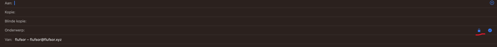

# Project 4: Mail certificates on MacOS

Link to Git repo: https://github.com/nvdg2/CSA4-mail
Link to previous pki project: https://github.com/kelvin-ap/CSA-PKI

## Team Members

- Jasper Van Meel
- Dante Requena
- Kelvin Bogaerts
- Niels Van De Ginste
- Tom Goedemé

## Introduction

As expansion on the previous PKI project, we added an extra functionality: signing of X509 certificates for use of mail certificates on MacOS Mail clients.
These certificates have the following paramaters:

- keyUsage: contentCommitment,digitalSignature, keyEncipherment
- keyExtUsage: MailProtection

## 1. Deploying

### `step ca init`

- Before deploying the flake, run `step ca init` on the server
  - Pick `standalone` & choose a name for the PKI. The only things that really matter here are the **name of the PKI** and the **password of the CA keys** (last option), just enter the examples for the other options.
  - All the other options will be overwritten by the config in the flake, but the flake does not generate the initial certificate files - that's why you have to run `step ca init`.
- Now run the following commands as root - assuming the `.step` directory generated by `step ca init` is in `/root/.step`:

```bash
mkdir -p /var/data/step-ca
# copy certs & secrets to /var/data/step-ca
cp -r /root/.step/certs/ /root/.step/secrets/ /var/data/step-ca/
# set ownership
chown -R step-ca /var/data/step-ca
```

### Flake configuration

- Use `agenix -e <file.age>` to edit the secret files, make sure that the secrets in the `step-server` directory of the flake contain the correct values:
  - `step.age` -> password to decrypt the root CA key (the password entered during `step ca init`)
  - `domain.age` -> domain on which the CA can be reached (make sure to configure an A/AAAA record in your DNS server)
  - `address.age` -> public IP address on which the CA server should listen (only address, no port)
- You could also put the domain & address into the flake directly. However, don't do this with the password, since contents of flake files are copied to the world-readable Nix store folder.
- Make sure the public key of the CA server is listed in `secrets.nix` so that it can decrypt the secrets
  - Find the public key of the server by running `ssh-keyscan <IP>`
- Make sure that **your** public key is listed under `users.users.root.openssh.authorizedKeys.keys` so that you can log in

## 2. Configuring Step-CA

- [Here](https://smallstep.com/docs/step-ca/configuration/#basic-configuration-options) you can find a list of all the configuration options.
- Configure the `X5C` provisioner for requesting X.509 certificates:

```nix
provisioners = [
  {
    type = "X5C";
    name = "x5c";
    roots = "LS0tLS1CRUdJ[...]yO0tR5EIUlRJRklDQVRLS0tLS0K";
    options.x509.template = ''{"subject": {{ toJson .Subject }},"sans": {{ toJson .SANs }},"keyUsage": ["contentCommitment","digitalSignature","keyEncipherment"],"extKeyUsage": ["emailProtection"]}'';
  }
];
```

- Note: the value of `roots` should be a **base64 encoded list of root certificate PEM blocks** used for validating X5C tokens
  - The X5C provisioner allows a client to authenticate a certificate request using an existing X.509 certificate from a different CA. For ease of use, we configured the X509 provider to trust its own root certificate. **This is NOT   recommended**, since anyone with a valid certificate from the CA can subsequently request any kind of certificate.
  - More information: https://smallstep.com/docs/step-ca/provisioners/#x5c---x509-certificate

- The template configured with `options.x509.template` will make sure that the `keyUsage` and `extKeyUsage` fields are set to the correct values for email signing & encryption. You can find more information about templates in the [official documentation](https://smallstep.com/docs/step-ca/templates/#x509-templates).

- Optionally modify the claims configuration, this was modified mainly to make sure that our certificates last longer than the default 24 hours:

```nix
claims = {
  minTLSCertDuration = "24h";
  maxTLSCertDuration = "8760h";
  defaultTLSCertDuration = "8760h";
};
```

## 4. Generating mail certificates V2

### Setting up a provisioner:
Use the following json file as template for a provisioner and create the template.plt file:

```json
{
    "subject": {
        { toJson .Subject
        }
    },
    "sans": {
        { toJson .SANs
        }
    },
    "keyUsage": [
        "contentCommitment",
        "digitalSignature",
        "keyEncipherment"
    ],
    "extKeyUsage": [
        "emailProtection"
    ]
}
```
Use the following command to create the mail certificate provisioner.

```bash
# request a new certificate using the leaf certificate generated by the previous command
step ca provisioner add [name of jwk provisioner] --type jwk --x509-template template.plt --create --ca-url [url of ca]
```

After the command has been executed, the CA will ask for some info:

- Enter the pass for the provisioner private key.
- When the ca asks for admin user credentials: user=step and password=[your step ca pass]

### Signing a Certificate Signing Request
Run the following command to request a signature for your MacOS CSR file.

```bash
# request a new certificate using the leaf certificate generated by the previous command
step-cli ca sign [signing request name].csr [certificate name].crt --ca-url [url of ca]
```

Choose your newly generated provisioner to sign the certificate and enter the pass of your JWT provisoner private key


## Configuring the MacOS Mail client

We assume an already working email client without any linked certificates.

### Installing the root CA cert
To configure the mail client we need to trust the root CA for mail usage.
We can either install the cert using the step CA client or using the MacOS keychain directly.

First we need to get the root CA cert on the MacOS computer, this can be achieved by many means but we will show a curl command for reference.

```bash
curl -k "https://ca.$PKI_DOMAIN_NAME:9000/roots.pem" > root_ca.crt
```

After downloading this file we double click it (using a admin account of the MacOS computer) to add it our keychain. This will install the cert onto the system. We can view that this has happend correctly by opening the keychain and go to Keychain Access(Sleutelhanger toegang) the n looking in the System keychain and looking for it in the list.


We then allow the use of S/MIME for this certificate by double clicking the certificate in the list and setting the Secure Mail (Beveiligder e-mail) to Always Trust (Vertouw altijd)


### Creating a certificate signing request

In the Keychain Access app on your Mac, choose Keychain Access > Certificate Assistant > Request a Certificate From a Certificate Authority.


Enter your email address, name, and save to disk, then save this file and sign it using the steps explaind in [Signing a Certificate Signing Request](#Signing-a-Certificate-Signing-Request)
Afterwars transfer the signed public key to the MacOS Mail computer.


### Importing the signed request public key
To import the certificate into Keychain Access, double-click the certificate file you received from the CA. Once you import your certificate, it should be listed in the My Certificates category in Keychain Access.

The certificate file must have a file extension that indicates it contains certificates — such as .cer, .crt, .p12 or .p7c — or Keychain Access can’t import it.

If Keychain Access can’t import the certificate, try dragging the file onto the Keychain Access icon in the Finder. If that doesn’t work, contact the CA to ask if the certificate is expired or invalid.

Open your certificate in Keychain Access and make sure its trust setting is Use System Defaults or Always Trust. Now you can use the certificate to send and receive signed and encrypted messages.

Note: If for some reason your certificate isn’t associated with your email address, or you want to use the certificate with a different email address, Control-click the certificate in Keychain Access, choose New Identity Preference, and provide the requested information.


## 5. Send digitally signed and encrypted emails

In the Mail app on your Mac, choose File > New Message.

### Signing a mail

Move the pointer over the From field, click the pop-up menu that appears, then choose the account for which you have a personal certificate in your keychain.

A signed icon (containing a tick) is shown in the message header and indicates your message will be signed when you send it.


### Encrypting a mail
Address the message to recipients were from you have a public certificate, by receiving a signed mail for all recipients.

An encrypted icon (containing a closed lock) is shown if your keychain contains a personal certificate for every recipient. If you don’t have a certificate for every recipient, click the encrypted icon in your message; an open lock replaces the closed lock, indicating the message will be sent unencrypted.



## Notes

Sources:
- Mail user guide for mac. Apple Support. (n.d.). https://support.apple.com/en-gb/guide/mail/
