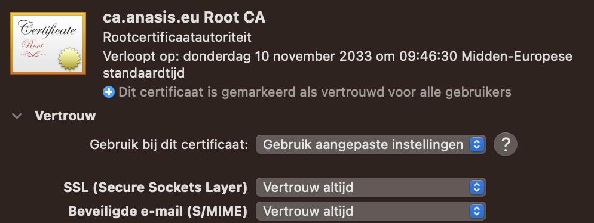
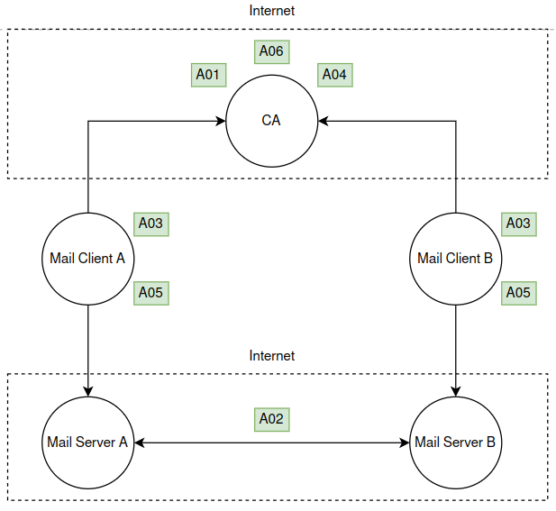

# Project 4: Mail certificates on MacOS

Link to Git repo: https://github.com/nvdg2/CSA4-mail
Link to previous PKI project: https://github.com/kelvin-ap/CSA-ja


## Team Members

- Dante Requena
- Kelvin Bogaerts
- Jasper Van Meel
- Niels Van De Ginste
- Tom Goedemé

## Introduction

As expansion on the previous PKI project, we added an extra functionality: signing of X509 certificates for use of mail certificates on MacOS Mail clients.
These certificates have the following paramaters:

- keyUsage: contentCommitment,digitalSignature, keyEncipherment
- keyExtUsage: MailProtection

This type of certificates will be given by a second JWT provisioner. This provisioner will have a template installed to specifically sign certificates for mail signing.

## Compatibility matrix with MacOS Mail

| Client    | Encryption | Signing |
| --------- |:----------:|:-------:|
| MacOs     |   check    |  check  |
| Evolution |   check    |  check  |
| Outlook   | skipped(!) |  check  |
| Gmail     |    paid    |  check  |

! Since the group using Outlook has its own mail server, we were unable to exchange emails directly with each other. As a result, we could only test whether the emails were correctly signed or not.

## 1. Deploying

As explained in our [previous repo](https://github.com/kelvin-ap/CSA-PKI), you can set up our CA by correctly filling in de `.env` file and executing the following command in de `step-ca` folder: `docker compose up`.

Also please install the root certificate of the ca on your system. You can obtain the `ca_root.crt` with the following link: https://[your_ca_domainname]:[port]/roots.pem

## 2. Generating mail certificates

Step 1: use the following json file, **as is**, as the template for a JWT provisioner and create the template.tlp file:

```json
{"subject": {{ toJson .Subject }},"sans": {{ toJson .SANs }},"keyUsage": ["contentCommitment","digitalSignature","keyEncipherment"],"extKeyUsage": ["emailProtection"]}

```

Use the following command to create the mail certificate provisioner.

```bash
step ca provisioner add [name of jwk provisioner] --type jwk --x509-template template.tlp --x509-min-dur 24h --x509-max-dur 8760h --x509-default-dur 8760h --create --ca-url [url of ca]
```

After the command has been executed, the CA will ask for some info:

- Enter the pass for the provisioner private key.
- When the ca asks for admin user credentials: user=step and password=[your step ca pass]

### Signing a Certificate Signing Request

Run the following command to request a signature for your MacOS CSR file.

```bash
step ca sign [signing request name].csr [certificate name].crt --ca-url [url of ca]
```

Choose your newly generated provisioner to sign the certificate and enter the pass of your JWT provisoner private key.

At the moment you have a certificate and a private key that can be used for S/MIME. But most mail clients only accept p12 files (the pkcs12 standard).

Step 4: create an p12 file using the following command:

```bash
step certificate p12 [p12 filename].p12 [certificate name].crt [certificate name].key 
```

Now you have the correct file for signing your emails. The only thing left is configure you mail client.

## Configuring the MacOS Mail client

We assume that we have an working MacOS mail client without any linked certificates.


### Installing the root CA cert

To configure the mail client we need to trust the root CA for mail usage.
We can either install the cert using the step CA client or using the MacOS keychain directly.

First we need to get the root CA cert on the MacOS computer, this can be achieved by many means but we will show a curl command for reference.

```bash
curl -k "https://ca.$PKI_DOMAIN_NAME:9000/roots.pem" > root_ca.crt
```

After downloading this file we double click it (using a admin account of the MacOS computer) to add the certificate to our keychain. This will install the cert onto the system. We can view that this has happened correctly by opening the keychain and go to Keychain Access (Nederlands: Sleutelhanger toegang). The following step is to look in the System keychain for our certificate.


In the next step, we will allow the use of S/MIME for this certificate by double clicking the certificate in the list and set the Secure Mail flag (Beveiligder e-mail) to Always Trust (Vertrouw altijd)



### Creating a certificate signing request

In the Keychain Access app on your Mac, choose Keychain Access > Certificate Assistant > Request a Certificate From a Certificate Authority.


Enter your email address, name, and save to disk, then save this file and sign it using the steps explained in [Signing a Certificate Signing Request](<#Signing a Certificate Signing Request>)
Afterwards transfer the signed public key to the MacOS Mail computer.


### Importing the signed request public key

To import the certificate into Keychain Access, double-click the certificate file you received from the CA. Once you import your certificate, it should be listed in the My Certificates category in Keychain Access.

The certificate file must have a file extension that indicates it contains certificates — such as .cer, .crt, .p12 or .p7c — or Keychain Access can’t import it.

If Keychain Access can’t import the certificate, try dragging the file onto the Keychain Access icon in the Finder. If that doesn’t work, contact the CA to ask if the certificate is expired or invalid.

Open your certificate in Keychain Access and make sure its trust setting is "Use System Defaults" or "Always Trust". Now you can use the certificate to send and receive signed and encrypted messages.

Note: If for some reason your certificate isn’t associated with your email address, or you want to use the certificate with a different email address, Control-click the certificate in Keychain Access, choose New Identity Preference, and provide the requested information.


## 5. Send digitally signed and encrypted emails

In the Mail app on your Mac, choose File > New Message.

### Signing a mail

Move the pointer over the From field, click the pop-up menu that appears, then choose the account for which you have a personal certificate in your keychain.

A signed icon (containing a tick) is shown in the message header and indicates your message will be signed when you send it.


### Encrypting a mail

Address the message to recipients were from you have a public certificate, by receiving a signed mail for all recipients.

An encrypted icon (containing a closed lock) is shown if your keychain contains a personal certificate for every recipient. If you don’t have a certificate for every recipient, click the encrypted icon in your message; an open lock replaces the closed lock, indicating the message will be sent unencrypted.


## Threat model

Below you can find three pictures:
- The architecture that describes the flow of the mail components in this project
- The DREAD table which lists some potential vulnerabilities
- The STRIDE table that lists the attacks that can be performed based on the DREAD table

## Key store in MacOS

Fortunately MacOS has already built-in keys storage available. This means that all the private keys that are used, are kept safely by default. Below you can find the picture of the key of the mail certificate. The user doesn't need te give a password, but the keys can only be seen when the user is logged in and the user can only see his keys. (The administrator can see the system keys)


### Architecture


### DREAD table


### STRIDE table


## Notes

Sources:

- Mail user guide for mac. Apple Support. (n.d.). https://support.apple.com/en-gb/guide/mail/